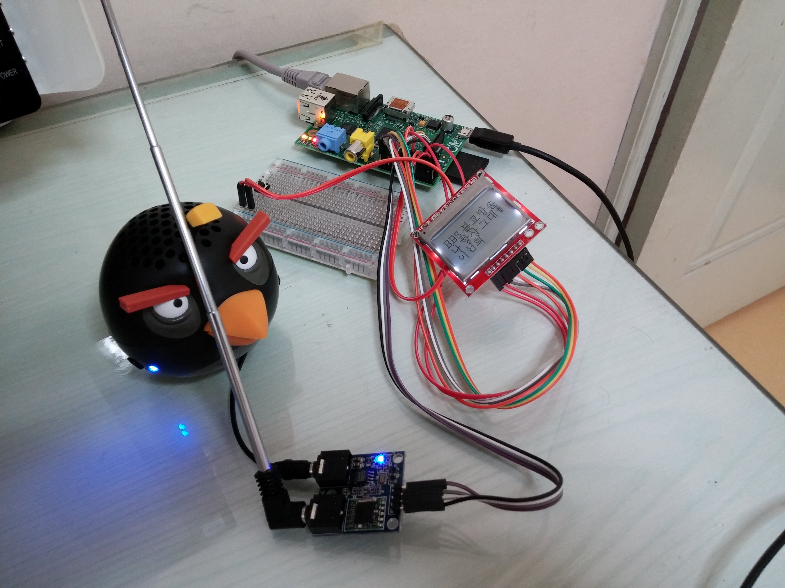

name: inverse
layout: true

---
class: title, center, middle, inverse

노래만 나오는 라디오
# <span class="sky">방</span>금 <span class="sky">그</span>  <span class="sky">라</span>디오
.footnote[
- [onairradio](https://www.facebook.com/pages/%EB%B0%A9%EA%B8%88%EA%B7%B8%EB%9D%BC%EB%94%94%EC%98%A4/760855817307720) on FaceBook
- [onairradio](https://github.com/dubu/onairradio) on GitHub
- [onairradio](https://github.com/dubu/onairradio) on YouTube
]


---
class: center, middle, inverse, full-text
.full-image[]

"방금그라디오"

---
class: center, middle, inverse, full-text

".gold[라디오 노래]만 듣고 싶다.<br>
.gold[광고]는 안듣고 싶은데..<br>
노래 골라들으며 안되나요<br>
노래만 듣고 싶다."

.pull-right[-- 노래만 듣고 싶은이]

---
class: center, middle, inverse, full-text

".gold[감사합니다.] 방송국 작가분들에 선곡에 감사합니다.<br>
.gold[좋네요]좋은노래들 많이 나옵니다.<br>
티비에는 아이돌 노래만 나오는데 골고루 좋은 노래들<br>
하루 종일 틀어 놓아도 좋아요"

---

class: middle, inverse, full-text
# 준비물

1. [방금그곡api](http://music.daum.net/onair/timeline)
1. python3
1. raspberry pi
1. [Nokia 5110 LCD](http://www.devicemart.co.kr/31029)
1. [스피커](http://www.10x10.co.kr/shopping/category_prd.asp?itemid=898765&rdsite=nvshop_sp&NaPm=ct%3Dhzw68blk%7Cci%3Dd6f9db6ebddfcf32f6bd366d6b80154138ec0cdd%7Ctr%3Dsl%7Csn%3D219718%7Chk%3D69a0516a1216cf93849a469bda19f1d5330d3df7)
1. [빵판](http://www.devicemart.co.kr/32298)
1. 스위치
1. [점퍼케이블](http://www.devicemart.co.kr/32284)

---
class: center, middle, inverse, full-text

# 선연결
.full-image[]
그림 보고 잘 뽑아 보자
---

class:  middle, full-text

시간이 좀 남았나요?

---
class:  middle, inverse, full-text

# 몇 가지 트릭

- 한글 파일 읽기: ["Decode early, encode late"](http://farmdev.com/talks/unicode/)

    ```python
    >>> with open('somefile.txt', 'r') as f:
    ...    doc = f.read().decode('utf-8')
    ```

    ```python
    >>> import codecs
    >>> codecs.open('somefile.txt', encoding='utf-8')
    ```

- sublee님의 [Hangulize](https://github.com/sublee/hangulize)

    ```python
    >>> from hangulize import hangulize
    >>> print hangulize('Guido van Rossum', 'nld')
    히도 판로쉼
    ```

---
# 작업

- pcd8544 Python library 설치 https://github.com/XavierBerger/pcd8544
- pil 라이브러리 python2 에서만 실행.
- python3 사용하기 위해 Pillow lib 설치.http://pillow.readthedocs.org/en/latest/installation.html
- 각종 에러가 발생하는데 lcd.py 적절히 수정해 준다.
- 한글폰트 설치 sudo apt-get install ttf-unfonts-core
- 그 밖에 각종 설치
    ```python
    sudo pip-3.2 install wiringpi
    sudo pip-3.2 install wiringpi2
    sudo pip-3.2 install spidev
    sudo pip-3.2 install spidev
    sudo pip-3.2 install Pillow
    ```
---
# 몇 가지 트릭

- 한글 romanize하기

    ```python
    >>> from unidecode import unidecode
    >>> unidecode(u'파이콘')
    'paikon'
    ```

- 한자, 한글, 영문가 섞여 있는 경우

    - Multilingual NLP에서 제안하는 다양한 접근법이 있습니다.
    - 간단한 꼼수 한 가지는: "한자 전처리, 영문 후처리"
        - 한자는 transliterate하고 (ex: '丁新闻' -> 정신문)
        - 한국어 처리를 한 후에 (ex: POS tagging)
        - 영문으로 분류된 tag에 한해 따로 stemming 등을 거침

---
class: center, middle, inverse, full-text

감사합니다 ^_^

http://onairradio.github.io<br>
[@방금그라디오](kozazz@hanmail.net)

